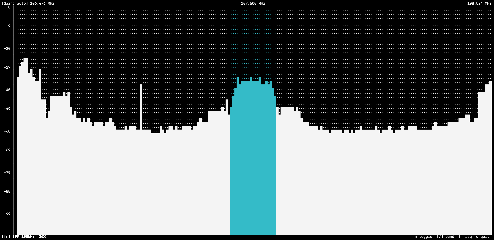

# SDRTerm — Terminal RF Spectrum Analyzer

A terminal-based RF spectrum analyzer for RTL-SDR dongles, written in Python.  
Displays a live dBFS spectrum in the terminal using curses, with interactive controls for frequency, bandwidth, gain, and pluggable decoders such as FM audio.

---

## Intention

The goal is a lightweight, dependency-minimal spectrum viewer that runs entirely in the terminal — no GUI, no browser, no heavy SDR framework.  
It reads raw IQ samples directly from RTL-SDR hardware via `pyrtlsdr`, computes an averaged FFT, and renders a scrolling spectrum with a dB-scaled vertical axis, similar to the waterfall-less view in GQRX or SDR#.

Decoders (FM audio, ADS-B, …) and hardware drivers are discovered at runtime from `plugins/` and `devices/` — adding support for a new mode or dongle requires only a single new file.

---

## Requirements

- **macOS** (Apple Silicon, Homebrew) — the library path fix is Apple Silicon / Homebrew specific; Linux works without it
- **RTL-SDR dongle** connected via USB
- **librtlsdr** installed via Homebrew: `brew install librtlsdr`
- **Python 3.12+** managed via `uv`

---

## Installation

```bash
brew install librtlsdr
uv sync
python fix_venv.py      # apply compatibility patches (see below)
```

---

## Usage

```bash
uv run python main.py
```

### Command-line parameters

| Flag | Argument | Description |
|------|----------|-------------|
| `--d` | `NAME` | Open a specific device by name (e.g. `RTL-SDR-V3`). Falls back to auto-detect if omitted. |
| `--f` | `FREQ` | Set the initial center frequency. Accepts `105.8M`, `433.5k`, or a raw Hz value. |
| `--g` | `GAIN` | Set the initial gain in dB (e.g. `32.8`). Ignored if `--i on` is also set. |
| `--i` | `on\|off` | Enable (`on`) or disable (`off`) hardware AGC at startup. |

Example:

```bash
uv run python main.py --d RTL-SDR-V3 --f 105.8M --g 28.0
```

---

## Display

### Core tab


The core tab shows the full-bandwidth spectrum.  
The header displays the current gain setting and the low / center / high frequencies of the visible window.  
The footer shows the active tab name, device status (bandwidth, bias-tee state), IQ correction state, and all available shortcuts.

### FM plugin tab



Switching to the FM plugin tab with `tab` highlights the selected FM channel bandwidth in cyan.  
The footer switches to FM-specific controls; core shortcuts (`f`, `q`) remain available on every tab.

---

## Keyboard controls

### Always available (all tabs)

| Key | Action |
|-----|--------|
| `f` | Enter frequency — type a value (`105.8M`, `433.5k`, `162000000`), `ret` to commit, `esc` to cancel |
| `tab` | Cycle through core tab and active plugin tabs |
| `q` | Quit |

### Core tab

| Key | Action |
|-----|--------|
| `←` / `→` | Shift center frequency left / right |
| `↑` / `↓` | Increase / decrease bandwidth (cycles through preset sample rates) |
| `a` | Toggle hardware AGC on/off |
| `g` | Enter gain mode — `↑`/`↓` adjust gain ±0.5 dB, `g` again to exit |
| `i` | Toggle software IQ correction on/off |
| `p` | Open plugin menu — `↑`/`↓` to navigate, `space` to stage, `ret` to apply, `esc` to cancel |
| `m` | Toggle FM decoder on/off (shown only when FM is available) |
| `b` | Toggle bias-tee on/off (RTL-SDR V3 only, shown only when hardware supports it) |

### FM plugin tab

| Key | Action |
|-----|--------|
| `[` | Narrow FM channel bandwidth (−10 kHz, min 30 kHz) |
| `]` | Widen FM channel bandwidth (+10 kHz, max 200 kHz) |
| `m` | Toggle FM decoder off |

---

## Bandwidth presets

`250 000` · `1 024 000` · `1 400 000` · `1 800 000` · `2 048 000` · `2 400 000` Hz

Bandwidth = RTL-SDR sample rate. Narrower bandwidth → lower noise floor (fewer noise watts per bin).  
Plugins declare their minimum required sample rate; enabling a plugin raises the bandwidth if necessary, but never lowers it below the current user setting.

---

## Plugin architecture

Plugins live in `plugins/`. Each file that contains a `Decoder` subclass with a non-empty `name` is discovered and loaded automatically at startup — no registration required.

```
plugins/
  spectrum.py   — always-on FFT display (built-in, key-less)
  fm.py         — FM broadcast audio decoder
  __init__.py   — auto-discovery loader
```

### Writing a plugin

Subclass `Decoder` from `core.py` and place the file in `plugins/`:

```python
from core import Decoder, AppState

class MyDecoder(Decoder):
    name            = 'mymode'          # unique ID
    key             = 'y'               # toggle key on core tab
    key_help        = 'y=mymode'        # shown in footer
    min_sample_rate = 250_000           # minimum BW this decoder needs

    def start(self, state: AppState) -> None:   ...
    def process(self, samples, state: AppState): return {}
    def stop(self) -> None:                     ...

    # optional hooks
    def handle_key(self, key, state, sdr) -> bool: ...
    def status_text(self, state, result) -> str:   ...
    def band_columns(self, state, freq_min, freq_range, plot_w): ...
```

The file is picked up on the next run with no other changes needed.

---

## Device architecture

Hardware drivers live in `devices/`. Each file that contains a `Device` subclass with a non-empty `name` is discovered automatically.

```
devices/
  rtlsdr_v3.py   — RTL-SDR V3 dongle (pyrtlsdr)
  __init__.py    — auto-discovery loader
```

The application tries each discovered device in filename order and opens the first one that succeeds. `--d NAME` selects a specific driver by name (case-insensitive).

### Writing a device driver

Subclass `Device` from `core.py` and place the file in `devices/`:

```python
from core import Device, AppState

class MyDevice(Device):
    name     = 'MY-DEVICE'    # unique ID matched by --d
    key_help = 'x=feature'    # device-specific shortcut hint in core footer

    def open(self) -> bool:   ...   # return False if hardware unavailable
    def close(self) -> None:  ...

    # must expose these as properties
    @property
    def sample_rate(self): ...
    @sample_rate.setter
    def sample_rate(self, v): ...

    @property
    def center_freq(self): ...
    @center_freq.setter
    def center_freq(self, v): ...

    @property
    def gain(self): ...
    @gain.setter
    def gain(self, v): ...

    def read_samples_async(self, callback, num_samples): ...
    def cancel_read_async(self): ...

    # optional UI hooks (core tab only)
    def handle_key(self, key, state: AppState) -> bool: ...
    def status_text(self, state: AppState) -> str: ...
```

---

## Gain

Starts at **0.0 dB manual** gain. Use `↑`/`↓` in gain mode (`g`) to step in 0.5 dB increments up to 49.6 dB.  
`a` enables hardware AGC (`[Gain: auto]`); pressing `a` again returns to the last manual value.

Auto gain is generally not recommended for spectrum analysis — the hardware AGC adjusts across the entire bandwidth in response to any strong signal, making the noise floor unstable and suppressing weak signals.

---

## IQ correction

Software-only, applied per frame before the FFT:

1. **DC offset removal** — subtracts the mean of the IQ samples, eliminating the centre-frequency spike caused by DC leakage in the ADC
2. **Amplitude balance** — scales the Q channel to match the I channel power, reducing mirror images
3. **Phase balance** — orthogonalises I and Q by removing the cross-correlation component, further reducing mirror images

---

## Implementation

### Signal processing

```
RTL-SDR IQ samples
  → reshape into N_AVG frames of FFT_BINS samples each
  → (optional) IQ correction per frame
  → Hann window × frame
  → FFT (FFT_BINS points) → fftshift
  → |FFT|² accumulated across N_AVG frames
  → 10·log10(mean power / FFT_BINS²)   [dBFS]
```

Constants:

| Name | Value | Purpose |
|------|-------|---------|
| `FFT_BINS` | 4096 | Bin count; larger = lower mean noise floor |
| `N_AVG` | 8 | Frames averaged per display update; reduces variance |
| `REFRESH_S` | 0.15 s | Target frame period (~7 fps) |
| `DB_MAX` / `DB_MIN` | 0 / −110 dBFS | Vertical axis range |

### FM decoder

FM audio is demodulated via instantaneous frequency (conjugate product of successive samples), then resampled to 48 kHz using `scipy.signal.resample_poly` with a ratio derived from `gcd(sample_rate, 48000)`. This allows the FM decoder to run at any bandwidth preset without forcing a sample-rate change on the hardware.

A 6th-order Chebyshev IF filter selects the channel around the centre frequency before demodulation; its bandwidth is controlled by `[`/`]`. A 15 kHz FIR audio LPF and a 50 µs de-emphasis IIR (EU standard) are applied after resampling.

### Noise floor

```
bin_width = sample_rate / FFT_BINS
```

Increasing `FFT_BINS` from 512 → 4096 lowers the mean floor by ~9 dB (`10·log10(4096/512)`).  
Reducing bandwidth lowers the floor further — identical to reducing the RBW on a bench spectrum analyser.

### curses rendering

- `nodelay(True)` — non-blocking key reads so sampling is not blocked by input
- `erase()` before each frame instead of `clear()` — avoids flicker
- C-level stderr (fd 2) is redirected to `/dev/null` during the curses session; `librtlsdr` prints messages to stderr on every sample-rate change, which would corrupt the display

---

## Compatibility patches

### Background

`pyrtlsdr 0.5.x` was written against an extended `librtlsdr` fork that adds GPIO and PLL dithering functions not present in the official osmocom build shipped by Homebrew (`librtlsdr 2.0.x`).

Without patches, importing `pyrtlsdr` fails at module load:

```
AttributeError: dlsym(…, rtlsdr_set_dithering): symbol not found
```

### What gets patched

`fix_venv.py` patches two files inside the project `.venv`:

**`.venv/…/rtlsdr/librtlsdr.py`** — seven missing ctypes symbol bindings wrapped in `try/except AttributeError`:

```python
try:
    f = librtlsdr.rtlsdr_set_dithering
    f.restype, f.argtypes = c_int, [p_rtlsdr_dev, c_int]
except AttributeError:
    pass
```

Functions patched: `rtlsdr_set_dithering`, `rtlsdr_set_gpio_input`, `rtlsdr_set_gpio_bit`, `rtlsdr_get_gpio_bit`, `rtlsdr_set_gpio_byte`, `rtlsdr_get_gpio_byte`, `rtlsdr_set_gpio_status`.

**`.venv/…/rtlsdr/rtlsdr.py`** — two runtime call sites inside `RtlSdr.open()` guarded with `hasattr`:

```python
if hasattr(librtlsdr, 'rtlsdr_set_dithering'):
    result = librtlsdr.rtlsdr_set_dithering(self.dev_p, int(dithering_enabled))
```

### Applying / re-applying patches

```bash
python fix_venv.py
```

`fix_venv.py` is idempotent — it detects whether each patch is already applied and skips it. Re-run after `uv sync --reinstall`.

### Homebrew library path (Apple Silicon)

Homebrew on Apple Silicon installs to `/opt/homebrew/lib`, which is not in the default `dyld` search path.  
`main.py` sets the environment variable before `pyrtlsdr` triggers `dlopen()`:

```python
os.environ.setdefault('DYLD_LIBRARY_PATH', '/opt/homebrew/lib')
```

---

## Project structure

```
main.py           — UI loop, keyboard dispatch, curses rendering
core.py           — shared constants, AppState, Decoder/Device base classes
fix_venv.py       — re-applies venv compatibility patches after uv sync --reinstall
pyproject.toml    — project metadata and dependencies
uv.lock           — locked dependency versions

plugins/
  __init__.py     — auto-discovery loader
  spectrum.py     — always-on FFT spectrum decoder
  fm.py           — FM broadcast audio decoder

devices/
  __init__.py     — auto-discovery loader
  rtlsdr_v3.py    — RTL-SDR V3 driver (pyrtlsdr)

images/
  01_main.png     — core tab screenshot
  02_plugin_fm.png — FM plugin tab screenshot
```
