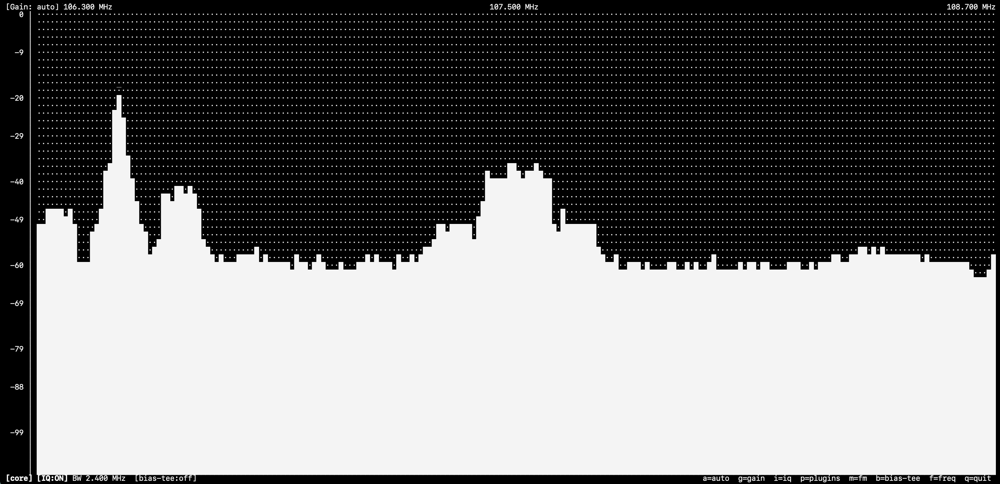
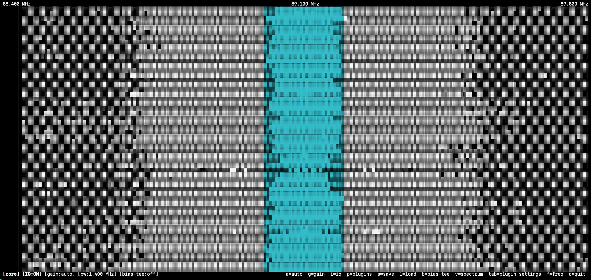

# SDRTerm — Terminal RF Spectrum Analyzer

A terminal-based RF spectrum analyzer for RTL-SDR dongles, written in Python.  
Displays a live dBFS spectrum in the terminal using curses, with interactive controls for frequency, bandwidth, gain, and pluggable decoders such as FM audio.

---

## Intention

The goal is a lightweight, dependency-minimal spectrum viewer that runs entirely in the terminal — no GUI, no browser, no heavy SDR framework.  
It reads raw IQ samples directly from RTL-SDR hardware via `pyrtlsdr`, computes an averaged FFT, and renders a scrolling spectrum with a dB-scaled vertical axis, similar to the waterfall-less view in GQRX or SDR#.

Decoders (FM audio, ADS-B, …) and hardware drivers are discovered at runtime from `plugins/` and `devices/` — adding support for a new mode or dongle requires only a single new file.

---

## Requirements

- **macOS** (Apple Silicon, Homebrew) — the library path fix is Apple Silicon / Homebrew specific; Linux works without it
- **RTL-SDR dongle** connected via USB
- **librtlsdr** installed via Homebrew: `brew install librtlsdr`
- **Python 3.12+** managed via `uv`

---

## Installation

```bash
brew install librtlsdr
uv sync
python fix_venv.py      # apply compatibility patches (see below)
```

---

## Usage

```bash
uv run python main.py
```

### Command-line parameters

| Flag | Argument | Description |
|------|----------|-------------|
| `--d` | `NAME` | Open a specific device by name (e.g. `RTL-SDR-V3`). Falls back to auto-detect if omitted. |
| `--file` | `PATH` | Replay a `.iq` (raw complex64), stereo `.wav`, or SigMF (`.sigmf-data` / `.sigmf`) IQ file instead of opening hardware. Selects the `localfile` device automatically. WAV and SigMF sample rates and centre frequency are read from the file metadata. |
| `--bw` | `BW` | Set the initial capture bandwidth / sample rate (e.g. `2.4M`, `1024k`, `250000`). For `.iq` files: must match the rate the file was recorded at. For `.wav` files: overrides the rate from the file header. |
| `--f` | `FREQ` | Set the initial center frequency. Accepts `105.8M`, `433.5k`, or a raw Hz value. |
| `--g` | `GAIN` | Set the initial gain in dB (e.g. `32.8`). Ignored if `--i on` is also set. |
| `--i` | `on\|off` | Enable (`on`) or disable (`off`) hardware AGC at startup. |

Examples:

```bash
# Live hardware
uv run python main.py --d RTL-SDR-V3 --f 105.8M --g 28.0

# Replay a recorded IQ file
uv run python main.py --file recording.iq --bw 2.4M --f 105.8M
```

---

## Display



The core tab shows the full-bandwidth spectrum.  
The header displays the current gain setting and the low / center / high frequencies of the visible window.  
The footer shows the active tab name, device status (bandwidth, bias-tee state), IQ correction state, and all available shortcuts.

Press `v` to switch between **spectrum** (bar chart) and **waterfall** (scrolling time-frequency) views. The waterfall fills from the top with the newest frame; older frames scroll downward. Signal strength is encoded in block characters (`░▒▓█`). Plugin overlays (such as the FM channel highlight) apply in both views.



---

## Keyboard controls

### Always available (all tabs)

| Key | Action |
|-----|--------|
| `f` | Enter frequency — type a value (`105.8M`, `433.5k`, `162000000`), `ret` to commit, `esc` to cancel |
| `tab` | Cycle through core tab and active plugin tabs |
| `q` | Quit |

### Core tab

| Key | Action |
|-----|--------|
| `←` / `→` | Shift center frequency by one display column (≈ bandwidth ÷ terminal width) |
| `,` / `.` | Shift center frequency by one FFT bin (finest step) |
| `↑` / `↓` | Increase / decrease bandwidth (steps through the current device's supported rates) |
| `a` | Toggle hardware AGC on/off |
| `g` | Enter gain mode — `↑`/`↓` adjust gain ±0.5 dB, `g` again to exit |
| `i` | Toggle software IQ correction on/off |
| `v` | Toggle between spectrum (bar chart) and waterfall (scrolling time-frequency) views |
| `p` | Open plugin menu — `↑`/`↓` navigate, `space` stage toggle, `<`/`>` reorder pipeline, `ret` apply, `esc` cancel |
| `b` | Toggle bias-tee on/off (RTL-SDR V3 only, when hardware supports it) |

### Plugin tabs (all plugins)

Navigate to a plugin tab with `tab`. Two keys are available on every plugin tab:

| Key | Action |
|-----|--------|
| `x` | Disable this plugin and return to the core tab |
| `d` | Open the debug console for this plugin (scroll with `↑`/`↓`/`PgUp`/`PgDn`, `esc` to close) |

---

## Plugins

| Plugin | Description | Docs |
|--------|-------------|------|
| `spectrum` | Always-on FFT display and waterfall | [spectrum.md](plugins/spectrum.md) |
| `fm` | FM broadcast audio decoder with channel-bandwidth highlight | [fm.md](plugins/fm.md) |
| `rds` | RDS decoder — PS name, RadioText, PTY, PI code, TP/TA | [rds.md](plugins/rds.md) |
| `nrsc5_text` | NRSC-5 HD Radio decoder (pure Python, CFO correction, Viterbi) | [nrsc5_text.md](plugins/nrsc5_text.md) |
| `peak_marker` | Peak-frequency marker with hold-off and alpha-beta Doppler tracking | [peak_marker.md](plugins/peak_marker.md) |
| `record` | Write signal to file (WAV audio or raw IQ/SigMF) | [record.md](plugins/record.md) |
| `rtl-tcp-passive` | RTL-TCP server — stream IQ to clients, ignore commands | [rtltcp_passive.md](plugins/rtltcp_passive.md) |
| `rtl-tcp-active` | RTL-TCP server — stream IQ and apply client commands to hardware | [rtltcp_active.md](plugins/rtltcp_active.md) |
| `range-scan` | Stepped frequency scan with signal detection list | [range_scan.md](plugins/range_scan.md) |

---

## Bandwidth

Bandwidth equals the IQ sample rate delivered by the device. Narrower bandwidth → lower noise floor (fewer noise watts per bin).

Each device declares the bandwidths it supports via `supported_bandwidths`. The `↑`/`↓` keys step through that list only — they never request a rate the device cannot handle.

**RTL-SDR V3 supported rates:** `250 000` · `1 024 000` · `1 400 000` · `1 800 000` · `2 048 000` · `2 400 000` Hz  
**localfile device:** all of the above (software device, accepts any step).

Plugins declare `min_sample_rate`; enabling a plugin raises the bandwidth if necessary, but never lowers it below the current user setting.

---

## Plugin architecture

Plugins live in `plugins/`. Each file that contains a `Decoder` subclass with a non-empty `name` is discovered and loaded automatically at startup — no registration required.

```
plugins/
  spectrum.py        — always-on FFT display (built-in, key-less)
  fm.py              — FM broadcast audio decoder
  rds.py             — RDS (Radio Data System) decoder
  nrsc5_text.py      — NRSC-5 HD Radio decoder (digital sideband, pure Python)
  peak_marker.py     — peak-frequency marker with hold-off and Doppler tracking
  record.py          — write signal to file (WAV or raw IQ)
  rtltcp_passive.py  — RTL-TCP server, streams IQ to clients (read-only)
  rtltcp_active.py   — RTL-TCP server, applies client frequency/gain/rate commands
  range_scan.py      — stepped frequency scan with signal detection list
  __init__.py        — auto-discovery loader
```

### Plugin pipeline

Active plugins run in the order shown in the plugin menu (filename order by default). Each plugin's `process()` receives the accumulated results of all plugins that ran before it — earlier plugins' output is visible to later ones via the `results` dict.

**Pipeline order matters.** The `record` plugin captures the output of its **immediate predecessor** in the pipeline: if FM precedes record, audio is saved as WAV; if record is first (or has no predecessor), raw IQ is written instead.

#### Reordering the pipeline

Open the plugin menu with `p`. While the menu is open:

| Key | Action |
|-----|--------|
| `↑` / `↓` | Move the cursor to a different plugin |
| `space` | Stage or unstage the highlighted plugin (toggle without applying) |
| `<` | Move the highlighted plugin one position earlier in the pipeline |
| `>` | Move the highlighted plugin one position later in the pipeline |
| `ret` | Apply all staged changes and close the menu |
| `esc` | Cancel — discard staged changes and restore the previous order |

The order shown in the menu is the execution order. Reordering is applied atomically when you press `ret`, so you can freely rearrange and toggle multiple plugins before committing.

A practical example: to record FM audio, open the menu, enable FM and record, and ensure FM appears **above** (before) record. If record is above FM, it sees raw IQ instead of decoded audio.

### Writing a plugin

Subclass `Decoder` from `core.py` and place the file in `plugins/`:

```python
from core import Decoder, AppState

class MyDecoder(Decoder):
    name            = 'mymode'          # unique ID
    key             = 'y'               # toggle key
    key_help        = 'o=path'          # shown in footer
    min_sample_rate = 250_000           # minimum BW this decoder needs

    def start(self, state: AppState) -> None:   ...
    def process(self, samples, state, results=None, sdr=None): return {}
    def stop(self) -> None:                     ...

    # optional hooks
    def handle_key(self, key, state, sdr) -> bool: ...
    def status_text(self, state, result) -> str:   ...
    def draw_overlay(self, screen_obj, state, result,
                     freq_min, freq_range, plot_w, height): ...
```

#### Drawing overlays on the core view

`draw_overlay()` is called after every frame (spectrum or waterfall) with a reference to the live curses window. The plugin can paint anything on top of the body rows using `chgat()` to change the color attribute of already-drawn characters:

```python
import curses
from core import LABEL_W

class MyDecoder(Decoder):
    def draw_overlay(self, screen_obj, state, result,
                     freq_min, freq_range, plot_w, height):
        span_l = state.center_hz - 50_000
        span_r = state.center_hz + 50_000
        col_l  = int(max(0,      (span_l - freq_min) / freq_range * plot_w))
        col_r  = int(min(plot_w, (span_r - freq_min) / freq_range * plot_w))
        if col_r <= col_l or not curses.has_colors():
            return
        n = col_r - col_l
        for r in range(height):
            try:
                screen_obj.chgat(r + 1, LABEL_W + col_l, n, curses.color_pair(1))
            except curses.error:
                pass
```

`chgat(y, x, n, attr)` recolors `n` characters at `(y, x)` in place without touching character content, so it works identically in both spectrum and waterfall modes. Color pair 1 is cyan (initialized by the framework at startup).

#### Full-view plugins

Set `full_view = True` to replace the entire spectrum body with a custom view. Implement `draw_full(screen_obj, state, result, rows, cols)` to render into the full terminal area (footer is drawn by the framework). See `range_scan.py` for a complete example.

### Making a plugin recordable

Implement the recording hooks so the `record` plugin can capture this plugin's output:

```python
class MyDecoder(Decoder):
    record_ext = 'myext'     # file extension; None = not recordable (default)

    def record_open(self, path: str):
        return open(path, 'wb')

    def record_write(self, handle, result: dict) -> int:
        data = result.get('mydata')
        handle.write(data)
        return len(data)

    def record_close(self, handle) -> None:
        handle.close()
```

---

## Device architecture

Hardware drivers live in `devices/`. Each file that contains a `Device` subclass with a non-empty `name` is discovered automatically.

```
devices/
  rtlsdr_v3.py   — RTL-SDR V3 dongle (pyrtlsdr)
  localfile.py   — IQ file replay (raw complex64 .iq or stereo .wav)
  __init__.py    — auto-discovery loader
```

The application tries each discovered device in filename order and opens the first one that succeeds. `--d NAME` selects a specific driver by name (case-insensitive). `--file PATH` selects the `localfile` device directly.

### localfile device

Replays an IQ file as if it were live hardware. The file loops continuously. Two formats are supported:

| Format | Extension | Layout | Sample rate | Centre frequency |
|--------|-----------|--------|-------------|-----------------|
| Raw IQ | `.iq` | Raw `complex64` binary | Must be supplied via `--bw` | Must be supplied via `--f` |
| WAV IQ | `.wav` | Stereo PCM (int16 / int32 / float32); left = I, right = Q | Read from WAV header automatically | Must be supplied via `--f` |
| SigMF  | `.sigmf-data` / `.sigmf` | Raw `cf32_le` binary + JSON metadata sidecar | Read from `.sigmf-meta` | Read from `.sigmf-meta`; follow mode works without `--f` |

```bash
# Raw IQ file — supply sample rate and centre frequency explicitly
uv run python main.py --file recording.iq --bw 2.4M --f 105.8M

# WAV IQ file — sample rate comes from the file header
uv run python main.py --file recording.wav --f 105.8M

# SigMF file — sample rate and centre frequency are read from the sidecar
uv run python main.py --file recording.sigmf-data
```

A synthetic Doppler test signal in SigMF format can be generated with `gen_doppler_test.py`:

```bash
uv run python gen_doppler_test.py          # writes doppler_test.sigmf-data/.sigmf-meta
uv run python main.py --file doppler_test.sigmf-data
# Enable peak_marker (k), go to its tab, press t — follow mode chases the drift
```

Pacing uses a monotonic deadline so the replay rate stays accurate regardless of processing time. Raw `.iq` files are memory-mapped (`np.memmap`) so large files do not load into RAM; WAV files are loaded fully into memory on open.

### Writing a device driver

Subclass `Device` from `core.py` and place the file in `devices/`:

```python
from core import Device, AppState

class MyDevice(Device):
    name                 = 'MY-DEVICE'              # unique ID matched by --d
    key_help             = 'x=feature'              # shortcut hint in core footer
    supported_bandwidths = [1_000_000, 2_000_000]   # Hz, ascending order

    def open(self) -> bool:   ...   # return False if hardware unavailable
    def close(self) -> None:  ...

    @property
    def sample_rate(self): ...
    @sample_rate.setter
    def sample_rate(self, v): ...

    @property
    def center_freq(self): ...
    @center_freq.setter
    def center_freq(self, v): ...

    @property
    def gain(self): ...
    @gain.setter
    def gain(self, v): ...

    def read_samples_async(self, callback, num_samples): ...
    def cancel_read_async(self): ...

    # optional UI hooks (core tab only)
    def handle_key(self, key, state: AppState) -> bool: ...
    def status_text(self, state: AppState) -> str: ...
```

`supported_bandwidths` is the only list the application consults for `↑`/`↓` BW stepping — it is not required to match the global `BW_STEPS` constant and can contain any values the hardware supports.

---

## Gain

Starts at **0.0 dB manual** gain. Use `↑`/`↓` in gain mode (`g`) to step in 0.5 dB increments up to 49.6 dB.  
`a` enables hardware AGC (`[Gain: auto]`); pressing `a` again returns to the last manual value.

Auto gain is generally not recommended for spectrum analysis — the hardware AGC adjusts across the entire bandwidth in response to any strong signal, making the noise floor unstable and suppressing weak signals.

---

## IQ correction

Software-only, applied per frame before the FFT:

1. **DC offset removal** — subtracts the mean of the IQ samples, eliminating the centre-frequency spike caused by DC leakage in the ADC
2. **Amplitude balance** — scales the Q channel to match the I channel power, reducing mirror images
3. **Phase balance** — orthogonalises I and Q by removing the cross-correlation component, further reducing mirror images

---

## Implementation

### curses rendering

- `nodelay(True)` — non-blocking key reads so sampling is not blocked by input
- `erase()` before each frame instead of `clear()` — avoids flicker
- C-level stderr (fd 2) is redirected to `/dev/null` during the curses session; `librtlsdr` prints messages to stderr on every sample-rate change, which would corrupt the display

---

## Compatibility patches

### Background

`pyrtlsdr 0.5.x` was written against an extended `librtlsdr` fork that adds GPIO and PLL dithering functions not present in the official osmocom build shipped by Homebrew (`librtlsdr 2.0.x`).

Without patches, importing `pyrtlsdr` fails at module load:

```
AttributeError: dlsym(…, rtlsdr_set_dithering): symbol not found
```

### What gets patched

`fix_venv.py` patches two files inside the project `.venv`:

**`.venv/…/rtlsdr/librtlsdr.py`** — seven missing ctypes symbol bindings wrapped in `try/except AttributeError`:

```python
try:
    f = librtlsdr.rtlsdr_set_dithering
    f.restype, f.argtypes = c_int, [p_rtlsdr_dev, c_int]
except AttributeError:
    pass
```

Functions patched: `rtlsdr_set_dithering`, `rtlsdr_set_gpio_input`, `rtlsdr_set_gpio_bit`, `rtlsdr_get_gpio_bit`, `rtlsdr_set_gpio_byte`, `rtlsdr_get_gpio_byte`, `rtlsdr_set_gpio_status`.

**`.venv/…/rtlsdr/rtlsdr.py`** — two runtime call sites inside `RtlSdr.open()` guarded with `hasattr`:

```python
if hasattr(librtlsdr, 'rtlsdr_set_dithering'):
    result = librtlsdr.rtlsdr_set_dithering(self.dev_p, int(dithering_enabled))
```

### Applying / re-applying patches

```bash
python fix_venv.py
```

`fix_venv.py` is idempotent — it detects whether each patch is already applied and skips it. Re-run after `uv sync --reinstall`.

### Homebrew library path (Apple Silicon)

Homebrew on Apple Silicon installs to `/opt/homebrew/lib`, which is not in the default `dyld` search path.  
`main.py` sets the environment variable before `pyrtlsdr` triggers `dlopen()`:

```python
os.environ.setdefault('DYLD_LIBRARY_PATH', '/opt/homebrew/lib')
```

---

## Project structure

```
main.py                — UI loop, keyboard dispatch, curses rendering
core.py                — shared constants, AppState, Decoder/Device base classes
fix_venv.py            — re-applies venv compatibility patches after uv sync --reinstall
diag_nrsc5.py          — standalone NRSC-5 diagnostic script (CFO, sync, Viterbi pipeline)
gen_doppler_test.py    — generates a synthetic LEO Doppler SigMF test file (±20 kHz, 10 s)
pyproject.toml         — project metadata and dependencies
uv.lock                — locked dependency versions

plugins/
  __init__.py          — auto-discovery loader
  spectrum.py          — always-on FFT spectrum decoder
  spectrum.md          — spectrum plugin documentation
  fm.py                — FM broadcast audio decoder (with WAV recording hooks)
  fm.md                — FM plugin documentation
  rds.py               — RDS decoder: PS name, RadioText, PTY, PI code, TP/TA flags
  rds.md               — RDS plugin documentation
  nrsc5_text.py        — NRSC-5 HD Radio decoder (pure Python, CFO correction, Viterbi)
  nrsc5_text.md        — NRSC-5 plugin documentation
  peak_marker.py       — peak-frequency marker with hold-off and Doppler tracking
  peak_marker.md       — peak marker plugin documentation
  record.py            — write signal to file via predecessor plugin's recording hooks
  record.md            — record plugin documentation
  rtltcp_passive.py    — RTL-TCP server: stream IQ to clients, ignore commands
  rtltcp_passive.md    — RTL-TCP passive server documentation
  rtltcp_active.py     — RTL-TCP server: stream IQ and apply client commands to hardware
  rtltcp_active.md     — RTL-TCP active server documentation
  range_scan.py        — stepped frequency scan with signal detection list
  range_scan.md        — range-scan plugin documentation
  images/
    02_plugin_fm.png   — FM plugin tab screenshot

devices/
  __init__.py          — auto-discovery loader
  rtlsdr_v3.py         — RTL-SDR V3 driver (pyrtlsdr)
  localfile.py         — IQ file replay device (raw complex64, memory-mapped)

images/
  01_main.png          — core tab screenshot
  03_waterfall.png     — waterfall view screenshot
```
