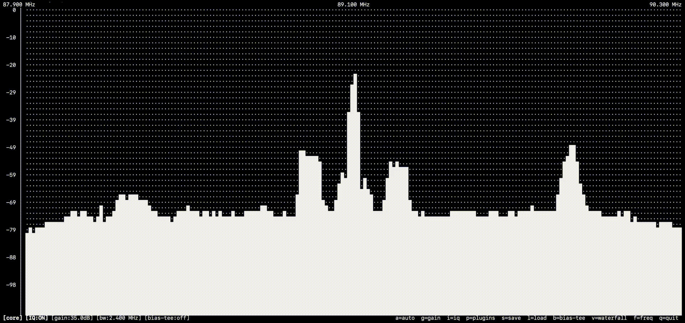
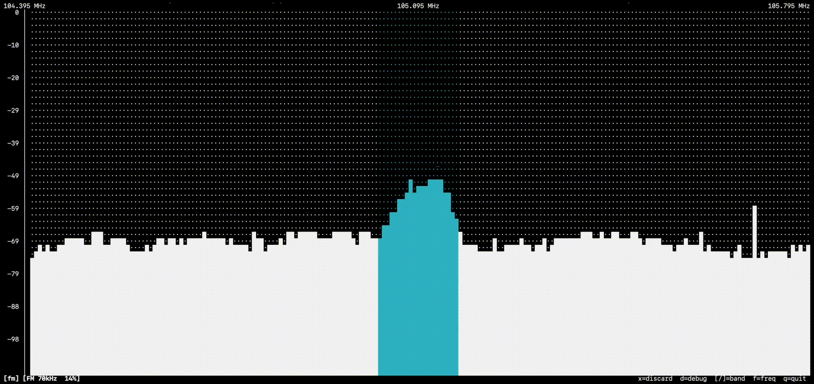
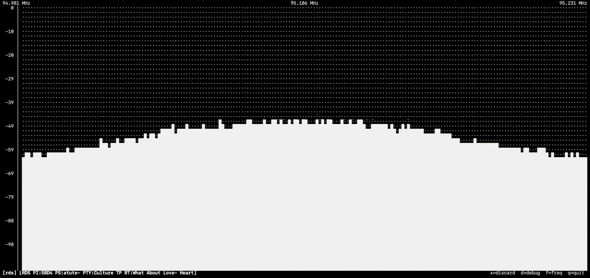
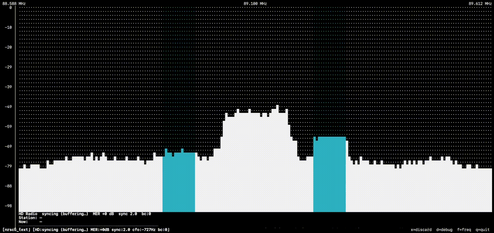
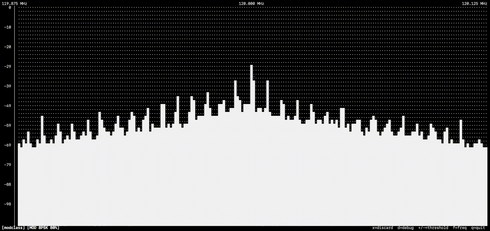
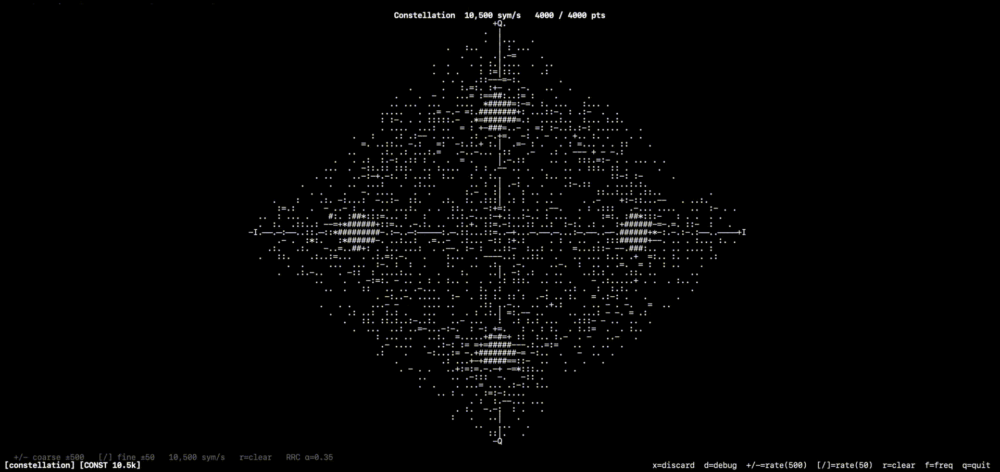
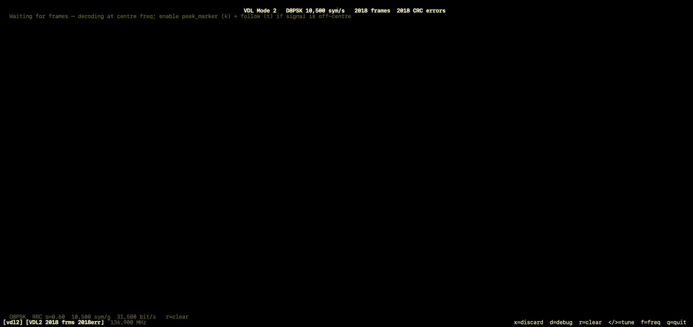
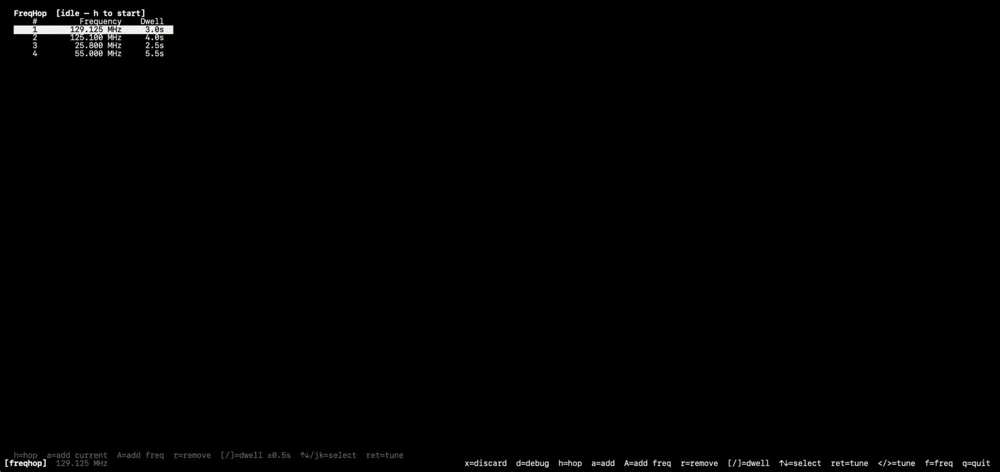

# Plugins

| Plugin | Description | Preview | Docs |
|--------|-------------|---------|------|
| **spectrum** | Always-active FFT display — averaged dBFS power spectrum rendered as bar chart or waterfall |   | [spectrum.md](spectrum/spectrum.md) |
| **fm** | FM broadcast audio decoder with real-time playback and channel-bandwidth highlight |  | [fm.md](fm/fm.md) |
| **rds** | RDS decoder — PS name, RadioText, PTY, PI code, TP/TA flags from the FM 57 kHz subcarrier |  | [rds.md](rds/rds.md) |
| **nrsc5_text** | NRSC-5 HD Radio decoder for digital IBOC sidebands, pure Python/NumPy |  | [nrsc5_text.md](nrsc5_text/nrsc5_text.md) |
| **peak_marker** | Marks the strongest signal peak; hold-off, alpha-beta Doppler tracking, and follow mode |  | [peak_marker.md](peak_marker/peak_marker.md) |
| **modclass** | Live modulation classifier — identifies OOK, AM, FM, BPSK, QPSK, 8PSK, QAM16, FSK using an on-device neural network |  | [modclass.md](modclass/modclass.md) |
| **constellation** | IQ constellation scatter plot — tune symbol rate until clusters snap into focus to identify modulation order |  | [constellation.md](constellation/constellation.md) |
| **range-scan** | Stepped frequency scan across a configurable range with SNR-based signal detection list |  | [range_scan.md](range_scan/range_scan.md) |
| **record** | Captures IQ or plugin output to SigMF / WAV file; press `e` to start and stop recording | | [record.md](record/record.md) |
| **rtl-tcp-passive** | Streams live IQ over TCP to RTL-TCP-compatible clients; hardware stays under SDRTerm control | | [rtltcp_passive.md](rtltcp_passive/rtltcp_passive.md) |
| **rtl-tcp-active** | Like passive, but also forwards client frequency, gain, and sample-rate commands to hardware | | [rtltcp_active.md](rtltcp_active/rtltcp_active.md) |
| **vdl2** | VDL Mode 2 decoder — D8PSK 10,500 sym/s, HDLC/AVLC frames, ACARS text; tune to a VDL2 channel at 250 kHz bandwidth and press `v` |  | [vdl2.md](vdl2/vdl2.md) |
| **freqhop** | Frequency hopper — maintain a saved list of frequencies with per-slot dwell times; cycles automatically so you can monitor multiple airband channels |  | [freqhop.md](freqhop/freqhop.md) |
| **acars** | Classic ACARS decoder — AM/AFSK 2400 baud, mark=2400 Hz / space=1200 Hz; decodes aircraft registration, flight ID, and message text with BCS integrity check | | [acars.md](acars/acars.md) |
