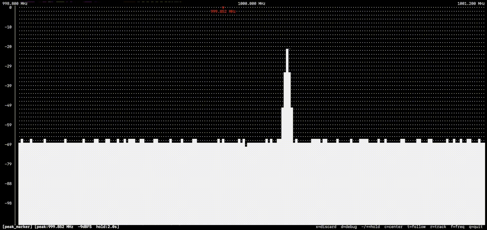
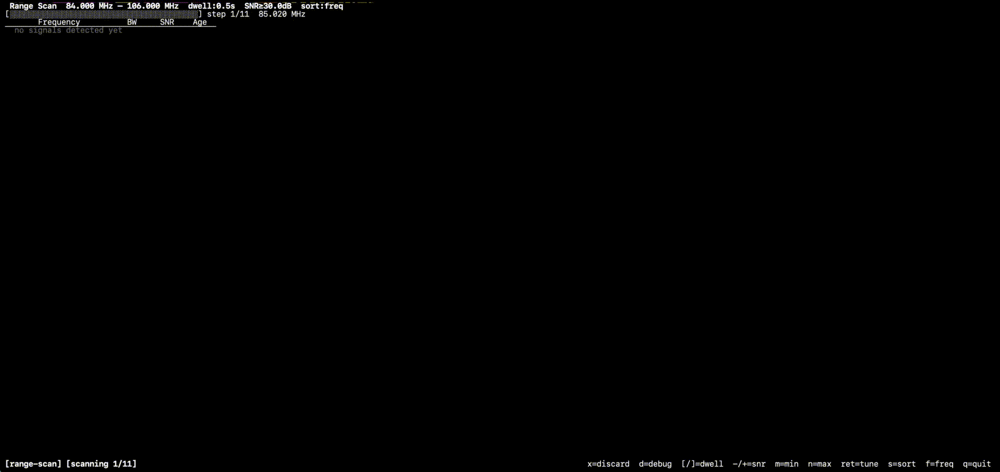

# Plugins

| Plugin | Description | Preview | Docs |
|--------|-------------|---------|------|
| **spectrum** | Always-active FFT display — averaged dBFS power spectrum rendered as bar chart or waterfall | | [spectrum.md](spectrum.md) |
| **fm** | FM broadcast audio decoder with real-time playback and channel-bandwidth highlight | | [fm.md](fm.md) |
| **rds** | RDS decoder — PS name, RadioText, PTY, PI code, TP/TA flags from the FM 57 kHz subcarrier | | [rds.md](rds.md) |
| **nrsc5_text** | NRSC-5 HD Radio decoder for digital IBOC sidebands, pure Python/NumPy |  | [nrsc5_text.md](nrsc5_text.md) |
| **peak_marker** | Marks the strongest signal peak; hold-off, alpha-beta Doppler tracking, and follow mode |  | [peak_marker.md](peak_marker.md) |
| **range-scan** | Stepped frequency scan across a configurable range with SNR-based signal detection list |  | [range_scan.md](range_scan.md) |
| **record** | Captures IQ or plugin output to SigMF / WAV file; press `e` to start and stop recording | | [record.md](record.md) |
| **rtl-tcp-passive** | Streams live IQ over TCP to RTL-TCP-compatible clients; hardware stays under SDRTerm control | | [rtltcp_passive.md](rtltcp_passive.md) |
| **rtl-tcp-active** | Like passive, but also forwards client frequency, gain, and sample-rate commands to hardware | | [rtltcp_active.md](rtltcp_active.md) |
