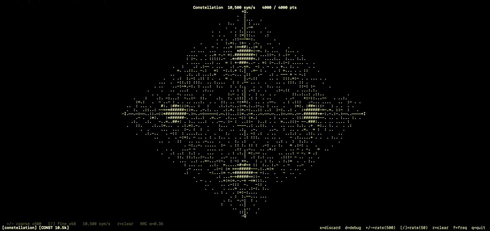

> **This document is written in [ASD-STE100 Simplified Technical English](https://en.wikipedia.org/wiki/Simplified_Technical_English).** For the full-English version, see [`README.md`](README.md) (or the original filename in the same folder).

# constellation — IQ Constellation Display

The plugin shows the phase-space scatter plot of the tuned signal. Use it
to see the modulation order of a digital carrier. Use it also to tune the
symbol rate until the clusters become sharp.

The plugin has its own **M-th-power carrier estimator**. This estimator
finds the carrier offset in a window of ±30 kHz around `state.center_hz`
on each chunk (or on each burst when the burst gate is on). No external
tracking plugin is needed. Tune close to the target signal and the plugin
locks on.

## Controls

| Key | Action |
|-----|--------|
| `+` / `=` | Raise symbol rate (coarse, +500 sym/s) |
| `-` | Lower symbol rate (coarse, −500 sym/s) |
| `]` | Raise symbol rate (fine, +50 sym/s) |
| `[` | Lower symbol rate (fine, −50 sym/s) |
| `,` | Turn reference markers counter-clockwise |
| `.` | Turn reference markers clockwise |
| `z` | Change between absolute and differential display mode |
| `b` | Change burst gate on / off (add symbols only during detected bursts) |
| `r` | Clear the scatter buffer |

## How to read the display

Each dot is one recovered symbol. The plugin plots it at its (I, Q)
coordinates after normalisation. For a correct PSK signal, the dots group
at fixed angles on the unit circle:

| Modulation | Clusters | Angles |
|------------|----------|--------|
| BPSK | 2 | 0°, 180° |
| QPSK | 4 | 45°, 135°, 225°, 315° |
| 8PSK | 8 | 22.5°, 67.5°, … |

If the symbol rate is **too low**, the clusters smear into arcs. You sample
in the middle of symbol transitions. If the symbol rate is **too high**, you
get many overlapping rings. At the correct rate, the clusters snap into
tight blobs.

## How it works

1. **Internal carrier estimator** — the plugin raises the IQ chunk to the
   M-th power (M is the current constellation size). It takes an FFT of
   the result. It finds the peak inside a ±30 kHz search window around
   DC. It divides by M to get the carrier offset. In continuous mode, the
   estimate uses EMA smoothing across chunks. In burst-gated mode, it
   resets on each burst edge. This makes per-burst Doppler jumps track
   cleanly (Iridium LEO Doppler is ±40 kHz). The estimator accepts a
   lock only when the peak is 12 dB above the search-window median.
   Otherwise, it keeps the previous estimate. The header shows
   `[CAR ±NNN Hz]` when the estimator is locked.
2. The plugin mixes the estimated carrier to DC. It then resamples the
   result to 8 samples per symbol with rational resampling (`resample_poly`).
3. A matched root-raised-cosine filter (α = 0.35) removes inter-symbol
   interference. Most real digital links use this filter shape on the
   transmit side.
4. A 4th-power batch phase estimate removes the residual carrier phase
   offset per frame. This stops the constellation from spinning.
5. The plugin takes one sample at the centre of each symbol period. It adds
   this sample to a rolling buffer of 4 000 symbols.

## Tuning procedure

1. Tune to the target signal (or close — the estimator handles ±30 kHz).
2. Change to the constellation tab.
3. Press `m` until the cluster count matches your target (BPSK, QPSK, 8PSK,
   or 16PSK). For bursty signals, also press `b` to turn on the burst gate.
4. Press `+` or `-` to sweep the symbol rate. Look for the scattered ring
   to become distinct blobs.
5. When the blobs are tight, read the symbol rate from the footer. This
   value and the number of visible clusters together show the modulation.
   For example: 4 clusters at 10 500 sym/s means QPSK at VDL Mode 2 rate.

## Verified test signal

`samples/constellation_test.sigmf-data` is a synthetic QPSK signal at
10 500 sym/s with 20 dB SNR. The script
`scripts/gen_constellation_test.py` makes it.

Replay:

```bash
uv run python main.py \
  --file samples/constellation_test.sigmf-data \
  --bw 250000 \
  --f 120M
```

Change to the constellation tab. Set the symbol rate to **10 500 sym/s**.

### What "right" looks like

The examples below are for the **QPSK test signal**. For other modulations
the number of blobs changes (2 for BPSK, 8 for 8PSK, and so on). But the
diagnostic logic — tight blobs against smeared ring — is the same for all
PSK.

For the QPSK test signal you see four compact blobs. There is empty space
between them. You also see a clear crosshair at the origin. The blobs may
land on the axes (0°/90°/180°/270°) or on the diagonals
(45°/135°/225°/315°). Both are valid QPSK. There is a 90° rotational
ambiguity, and the display does not resolve it:



### What "wrong" looks like

**Symbol rate too low** — you sample in the middle of the transition
between symbols. The blobs smear outward into arcs. The arcs then join
into a continuous ring:

```
                    +Q

      . . ─ ─ ─ . .
    .               .
    .               .
    .       +       .
    .               .
    .               .
      . . ─ ─ ─ . .

                    -Q
```

**Symbol rate too high** — you sample each symbol many times. Each cluster
then splits into an inner and outer ring:

```
                    +Q

      * *  │  * *
     *   * │ *   *
─────────────+──────────
     *   * │ *   *
      * *  │  * *

                    -Q
```

**Carrier not locked or wrong signal** — you see a flat cloud of noise with
no structure. The header does not show `[CAR …]`. This means the internal
M-th-power carrier estimator cannot find a lock. Causes: the signal is not
PSK, the SNR is too low (below ~3 dB), the tuning is more than 30 kHz off
the carrier, or the selected `m` does not match the modulation order.

If you move the symbol rate away from 10 500 sym/s in either direction, the
clusters smear. This shows the tuning sensitivity.

## Display modes

Press `z` to change between **absolute** and **differential** phase
display.

- **Absolute** (default) — each dot is the raw recovered symbol position.
  This mode needs the 4th-power carrier estimator to remove the unknown
  phase offset. It works well for QPSK. It is not reliable for 8PSK and
  higher.
- **Differential** — each dot is the phase difference between two
  consecutive symbols (`sym[n] × conj(sym[n−1])`). The carrier phase
  cancels. So the display is stable for any PSK order. It also works
  correctly for differential encodings like D8PSK (VDL Mode 2).


## Burst gate

Press `b` to change a burst-only accumulation mode. When on, the plugin
adds symbols to the scatter buffer only when the mean IQ power of the
current chunk is more than 6 dB above the running noise floor. Noisy
periods between bursts are ignored. The last good picture stays on
screen rather than being replaced by noise.

The header shows `[GATE·ON]` during an active burst and
`[GATE·waiting]` between bursts. The noise floor tracks slowly. It
falls fast on quiet chunks and drifts up very slowly during activity.
This makes sure that bursts do not inflate the floor.

The gate is off by default. Continuous signals (broadcast QPSK, heavy
VDL Mode 2 traffic) do not need it. Turn it on for bursty signals —
Iridium (~20 ms bursts with long gaps), classic ACARS, POCSAG, ADS-B —
where the noise between bursts would otherwise fill the 4000-point
scatter buffer.

## Case study: Iridium DQPSK

Iridium downlinks in the L-band (1616.0 – 1626.5 MHz) are the main
example of why the burst gate is important. A healthy Iridium
constellation is also a useful reference for what a real DQPSK signal
looks like in this plugin. It is not a textbook four-corner square. It
is important to understand why.

**Settings the plot needs to be correct:**

| Setting | Value | Reason |
|---|---|---|
| Symbol rate | **25 000 sym/s** | Iridium's baud rate. If it is off by even a few hundred, the matched filter samples between symbols and smears everything into a diamond shape. |
| Modulation (`m`) | **4** (QPSK) | Iridium symbols are one of four phase positions. |
| Absolute / diff (`z`) | **DIFF** | Iridium is *differential* QPSK. The information is in the *change* of phase between two symbols in sequence, not the absolute phase. Absolute mode's 4th-power carrier estimator will turn each burst on its own and produce a smeared ring. |
| Burst gate (`b`) | **ON** | Iridium bursts occupy less than 10 % of the air time. Without the gate, the 4000-point buffer is 90 % or more noise between bursts. |

Change the tuning to a channel that shows bursts in the iridium plugin
tab. Any of the top few by count is good.

**What you must see:**

- A **bright cluster near (+1, 0)** — the `+I` position. Iridium
  bursts start with a long unmodulated preamble tone. In differential
  mode, no change of phase between two symbols in sequence means the
  differential product `sym × conj(sym)` lands at `(+1, 0)`. This
  cluster is normally the most dense area of the plot because the
  preamble is longer than the data payload that follows.
- A **weaker lobe near (−1, 0)** — the `−I` position. This is the
  180° phase-reversal cluster from data symbols that change to the
  opposite constellation point.
- **Two lobes above and below the +I cluster**, at approximately
  `(0, +1)` and `(0, −1)`. These are the ±90° transitions (data
  symbols that move to an adjacent QPSK position). They are usually
  less dense than +I and −I because random data hits all four
  positions. But the preamble bias tilts the weight toward 0°
  transitions.

**What you must NOT expect:**

- **Four tight, snap-together clusters.** The lobes are visible but
  always somewhat smeared. This is because the internal carrier
  estimator has a few hundred Hz of residual error (FFT bin width
  limit). At 25 kbaud that
  means a per-symbol phase rotation of a few degrees. This spreads
  each cluster along an arc.
- **Equal density in all four lobes.** The preamble is dominant.
  So `+I` is always the most bright. Data-payload symbols land in the
  other three lobes with less density.
- **Anything meaningful with the gate off or at the wrong symbol
  rate.** See the [Burst gate](#burst-gate) section.

If your plot shows all four lobes with the +I cluster as the brightest,
the receive chain is working. The antenna, LNA (if used), front-end
gain, symbol timing, and carrier tracking are all doing their job.
Further cleanup would require a tight-lock frequency-locked loop in
the constellation plugin (not currently implemented).

## What the constellation can identify

### Modulation family and order

| Pattern on screen | Modulation |
|---|---|
| 2 clusters on real axis | BPSK |
| 4 clusters at 90° intervals, same radius | QPSK |
| 8 or 16 clusters on a single ring | 8PSK / 16PSK |
| Grid of clusters at many amplitudes | 16QAM, 64QAM, 256QAM |
| Two or more concentric rings with clusters | APSK (e.g. DVB-S2) |
| Smeared arcs, no discrete clusters | GMSK / MSK (continuous phase) |

The first key question is **ring or grid**. PSK and APSK put all points at
equal or quantised radii. QAM puts them on a rectangular grid with many
distinct amplitude levels. The current reference overlay (red `o` markers)
assumes a single ring. This is helpful for PSK/APSK. But you need a grid
overlay to align exactly with QAM.

### Signal quality and impairments

| Cluster shape | Cause |
|---|---|
| Whole constellation turned | carrier phase error |
| Clusters stretched along the radius | amplitude noise or AGC instability |
| Clusters stretched along the arc | phase noise |
| Not symmetric left/right against up/down | IQ imbalance |
| Whole constellation moved from origin | DC offset |

### What the constellation cannot show

- **Differential against absolute encoding** — same cluster positions with
  different bit mapping. You cannot tell them apart by sight.
- **Scrambling / LFSR whitening** — this randomises which cluster each
  symbol lands in. But it does not move the clusters.
- **FEC / channel coding rate** — coding is above the symbol layer.
- **OFDM** — the signal is the sum of many subcarriers. The total IQ looks
  like a uniform disc. You must demodulate individual subcarriers first.
- **Spread spectrum (DSSS)** — chips spread the energy. The constellation
  looks like noise for any symbol rate tuning.

## EVM measurement

The header shows **EVM** (Error Vector Magnitude) and an estimated **SNR**:

```
Constellation  10,500 sym/s  QPSK  21,000 bit/s  EVM 3.2%  ~30dB  4000/4000 pts
```

EVM is the RMS distance from each symbol to its nearest reference marker.
It is a percentage of the nominal symbol amplitude. Lower is better. The
SNR estimate comes from `SNR ≈ −20 log₁₀(EVM)`.

| EVM | ~SNR | Signal quality |
|---|---|---|
| < 5 % | > 26 dB | Excellent — you can use it for higher-order modulations |
| 5–10 % | 20–26 dB | Good — enough for QPSK/8PSK |
| 10–25 % | 12–20 dB | Marginal — BPSK/QPSK may still decode |
| > 25 % | < 12 dB | Poor — frame errors are likely |

### Rotation changes EVM accuracy

Each symbol is put with its **nearest** reference marker before the plugin
measures the error distance. If the markers are off by more than half the
angular slot spacing (> 45° for QPSK, > 22.5° for 8PSK), symbols go to the
wrong reference. Then EVM is falsely too high.

**Rule**: before you trust the EVM readout, use `,` or `.` to align the
red `o` markers to the visual centre of the actual clusters. After
alignment the EVM number is a true signal quality measurement. Small
misalignments (< half a slot) correct themselves through nearest-neighbour
assignment.

### Radius of the reference markers

Symbols are normalised to **median magnitude ≈ 1** before the plotting. So
for PSK signals (constant envelope), the cluster centres land very close to
the unit circle. The reference markers at radius = 1 are then accurate.

For **QAM** (many amplitude levels), the median of all symbols falls
between the inner and outer rings. This puts the unit-circle references in
the wrong place for every cluster. EVM will be too high for QAM signals
until the plugin supports per-ring reference radii. The current
implementation is accurate for any PSK/DPSK modulation order.


### Phase correction only works reliably for QPSK

The plugin uses a 4th-power carrier recovery to remove the unknown carrier
phase:

```
frame_phase = angle(mean(symbols⁴)) / 4
```

For QPSK this works well. The 4th power of the four symbol phases
{1, j, −1, −j} all collapse to 1. This gives a stable non-zero mean to
measure.

For **8PSK** the 4th power of the eight symbol phases gives only {+1, −1}.
For balanced data their mean is about zero. So `angle(0)` is undefined and
the correction gives garbage. The constellation spins continuously. It
shows a ring instead of 8 clusters.

For **16PSK and higher orders** the situation is the same or worse.

To recover carrier phase for M-PSK, you need an M-th power estimator
(`symbols^M`, then divide by M). That would add an M-way phase ambiguity.
You would then need a separate ambiguity resolver.

### D8PSK (VDL Mode 2) specifically does not work

VDL Mode 2 uses **differential** 8PSK. It has two extra problems apart
from the phase correction issue above:

1. **No dominant carrier tone to find.** D8PSK is wideband. The RRC
   pulse-shaping filter spreads its power across ~17 kHz. The internal
   M-th-power estimator sees only a diffuse cluster in the 8th-power
   spectrum. It cannot make a sharp lock. In practice VDL Mode 2 works
   because the signal is already at DC when you tune to it. The
   estimator falls back to offset = 0 when it is unlocked. This is
   correct.

2. **The 4th-power correction fails for 8PSK.** See the text above.

For VDL Mode 2, use the dedicated **VDL2 plugin** instead. That plugin
does wideband detection and differential decoding internally.

### Other limitations

- The RRC matched filter assumes α = 0.35. Real signals with different
  roll-off factors will give slightly wider clusters. But they stay
  readable.
- The display keeps the last 4 000 symbols. Press `r` to clear when you
  change signals or after you change the symbol rate.
