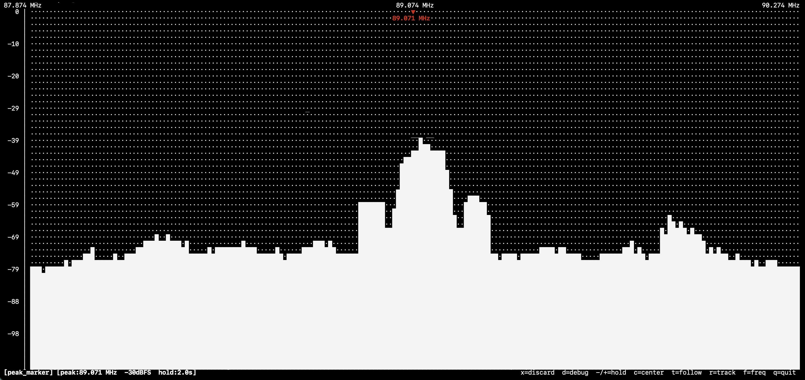

# peak_marker — Peak Frequency Marker

Marks the strongest signal peak in the visible spectrum and optionally follows or tracks it.

 Two operating modes are available.


## Controls

| Key | Action |
|-----|--------|
| `-` | Decrease hold time (−0.5 s, min 0.5 s) — hold-off mode only |
| `+` / `=` | Increase hold time (+0.5 s, max 10 s) — hold-off mode only |
| `c` | Retune SDR centre to the current peak frequency (one-shot) |
| `t` | Toggle follow mode |
| `r` | Toggle alpha-beta tracking mode |

## Hold-off mode (default)

The marker locks onto the strongest peak and holds its position for a configurable dwell time before updating. It snaps immediately if a signal 6 dB stronger appears elsewhere. Good for identifying and centering on a stable or slow-moving signal.

## Alpha-beta tracking mode (`r`)

Each frame the plugin predicts the signal's next frequency using the current drift-rate estimate, then searches only within ±10 kHz of that prediction. An alpha-beta filter updates both the frequency estimate and the drift rate from the measurement residual:

```
prediction  = freq_est + rate_est × dt
error       = measured_freq − prediction
freq_est   += α × error
rate_est   += β × error / dt
```

The hold-off timer is bypassed — the estimate updates every frame. The marker turns green and the status line shows the estimated drift rate (e.g. `TRACK −320 Hz/s`). Best for Doppler-shifting signals (satellites, aircraft) where the signal moves continuously and predictably.

## Follow mode (`t`)

Available in both modes. When active, issues a hardware retune whenever the tracked frequency drifts more than 500 Hz (tracking mode) or 1 kHz (hold-off mode) from the current SDR centre frequency, keeping the signal centred in the display.

Combining `r` + `t` is the recommended setup for Doppler tracking: the alpha-beta filter smooths the frequency estimate and rejects noise peaks, while follow mode keeps the signal on-screen.
