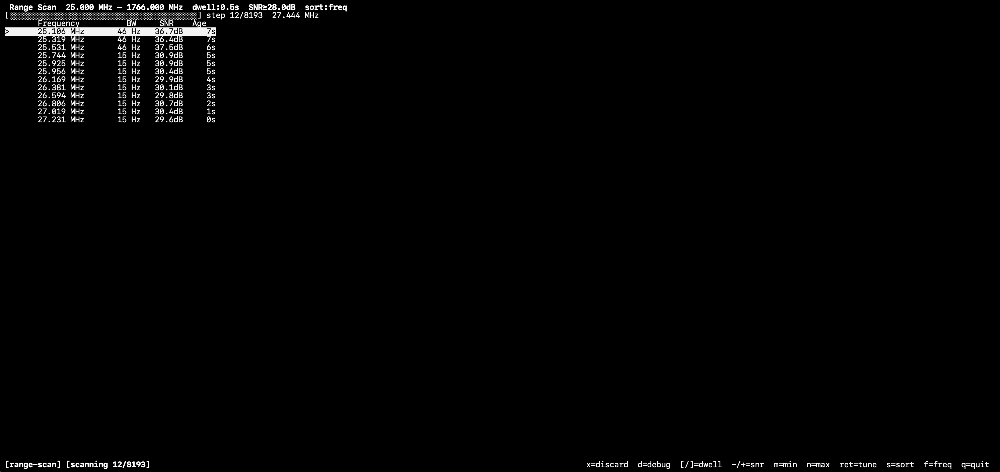

# range-scan — Frequency Range Scanner

Stepped scan across a configurable frequency range.

 Tunes the SDR through the range step by step, accumulates FFT power at each position, detects signal peaks by SNR, and presents a live list of found signals. Navigate the list and press return to tune to any signal.

## Controls

| Key | Action |
|-----|--------|
| `e` | Start or stop the scan |
| `↑` / `↓` | Move cursor up/down in the signal list |
| `ret` | Tune to the selected signal and stop scan |
| `[` | Decrease dwell time per step (−0.1 s, min 0.2 s) |
| `]` | Increase dwell time per step (+0.1 s, max 5.0 s) |
| `-` | Lower SNR detection threshold (−0.5 dB, min 3 dB) |
| `+` / `=` | Raise SNR detection threshold (+0.5 dB, max 30 dB) |
| `s` | Toggle sort order: frequency ↔ SNR |
| `m` | Set scan minimum frequency (opens frequency entry) |
| `n` | Set scan maximum frequency (opens frequency entry) |

## Scan range

If `m`/`n` are not set, the scan range is derived automatically:

1. Device `freq_min`/`freq_max` if available (RTL-SDR V3: 25 MHz – 1766 MHz)
2. Otherwise: centre frequency ± 20 × current bandwidth

The scan range, dwell time, SNR threshold, and sort order are all saved in presets and persist across sessions.

## Step size and dwell

Each step covers `bandwidth × 0.85` Hz. Adjacent steps overlap by 15 % so signals near step boundaries are not missed.

At each step the plugin waits 150 ms for the hardware to settle after retuning, then accumulates FFT frames for the configured dwell time before moving to the next step.

## Peak detection

Noise floor is estimated as the median power of the lower 70 % of FFT bins in the current step window. Bins exceeding the SNR threshold are grouped into contiguous runs; each run produces one signal entry at the bin with maximum SNR.

Only bins within the centre ± half-step-size zone are counted — the overlap region from the previous step is excluded to avoid double-counting.

## Signal list

Signals are displayed with frequency, estimated bandwidth, SNR, and age. Signals older than 30 s are dimmed. A signal is removed after 2 complete sweeps without re-detection (minimum 10 s age).
