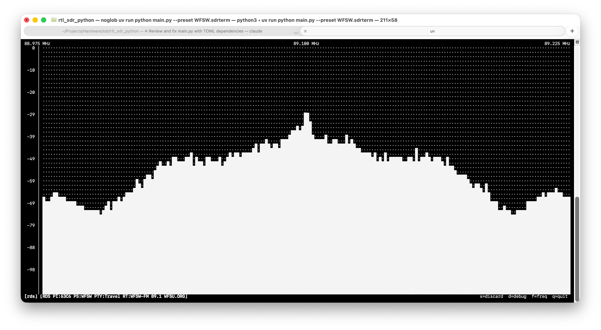

# rds — RDS Decoder

Decodes RDS (Radio Data System) data from the 57 kHz subcarrier of FM broadcasts.

 Displays PI code, PS name (station name), RadioText (song/artist), PTY (programme type), TP (traffic programme), and TA (traffic announcement) flags.

Requires the FM plugin to be active and earlier in the pipeline.

## Output

Data accumulates incrementally — the display fills in as groups are received. A full PS name (8 characters) typically arrives within a few seconds of tuning; RadioText may take 10–30 seconds depending on the station's broadcast cycle.

| Field | Description |
|-------|-------------|
| PI | Programme Identifier — unique station code |
| PS | Programme Service name — 8-character station name |
| RT | RadioText — up to 64 characters (song title, artist, etc.) |
| PTY | Programme Type — genre code (e.g. 4 = Rock, 10 = Pop) |
| TP | Traffic Programme flag |
| TA | Traffic Announcement flag — set during live traffic bulletins |

No tab-specific keys.
